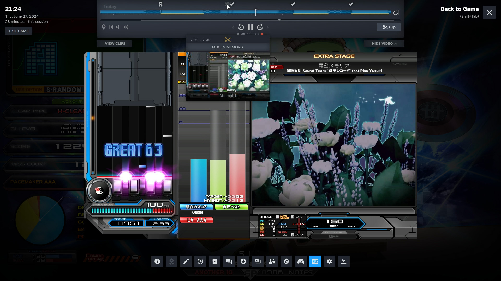

## infsteam

Basic Steamworks integration for [beatmania IIDX INFINITAS](https://p.eagate.573.jp/game/infinitas/2/index.html)

Implements game-added markers for scores and quick retries on the recording timeline

### Usage

> At the time of writing, [Steam Game Recording](https://store.steampowered.com/gamerecording) is currently in beta. If you do not see the recording interface while in-game, make sure you have opted into the beta client via **Settings > Interface > Client Beta Participation**

- Extract all files from any [pre-built release](https://github.com/aixxe/infsteam/releases) to the `game/app` directory
  - If you already have a `chainload.txt` file, add a new `infsteam.dll` line and save changes
- With Steam open, launch the game normally from the e-amusement website

Using the default AppID of [**480**](https://steamdb.info/app/480/), you will appear to be playing **Spacewar** within Steam

You can change this to any game in your Steam library by editing the `steam_appid.txt` file